# Portfolio UI Design - Mermaid Diagrams

## 🎨 Complete UI/UX Flow Diagram

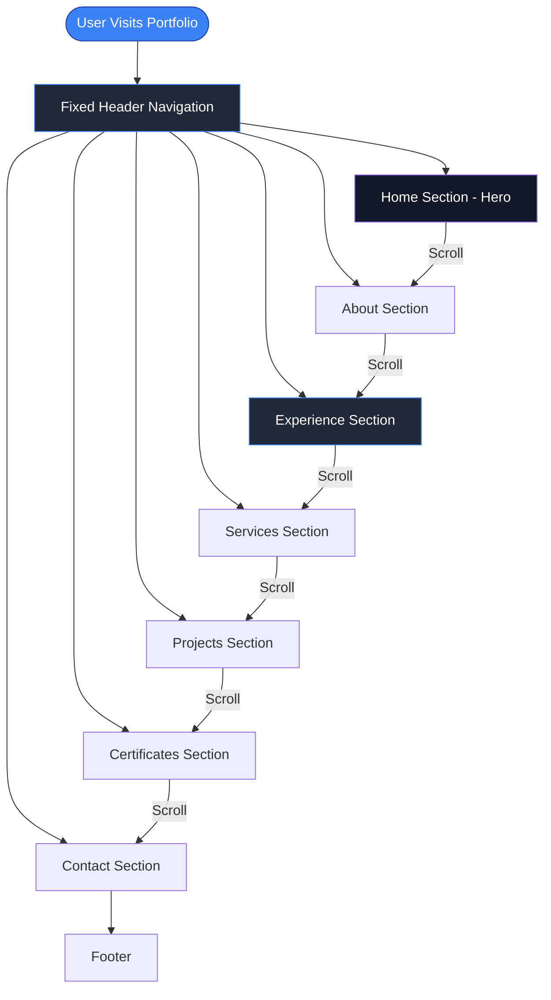

## 📱 Responsive Layout Structure

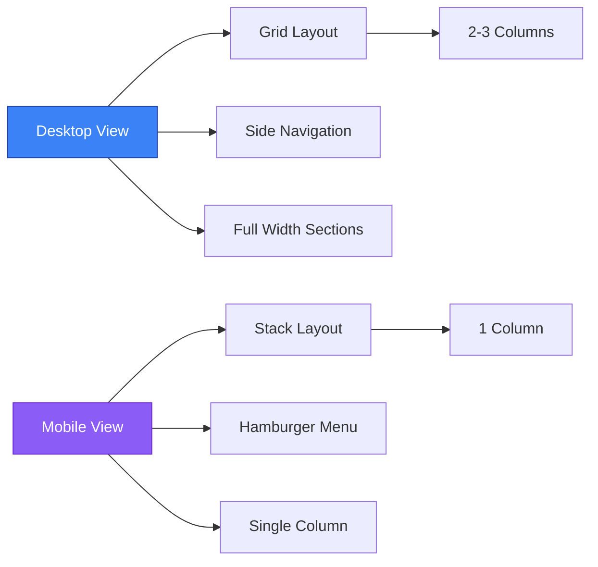

## 🎯 Experience Section - Case Study Flow

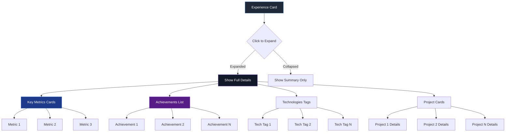

## 🎨 Color Scheme & Design System

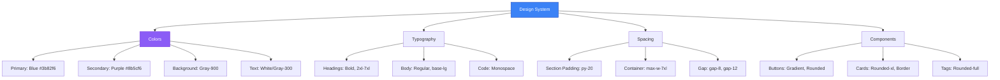

## 🔄 Interactive States & Animations

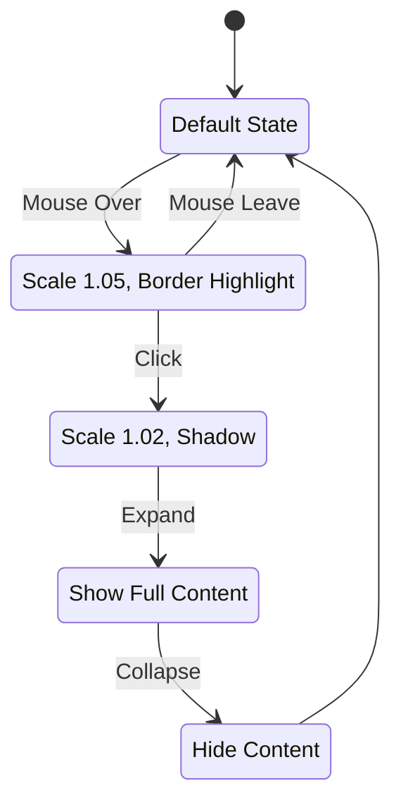

## 📊 Component Hierarchy

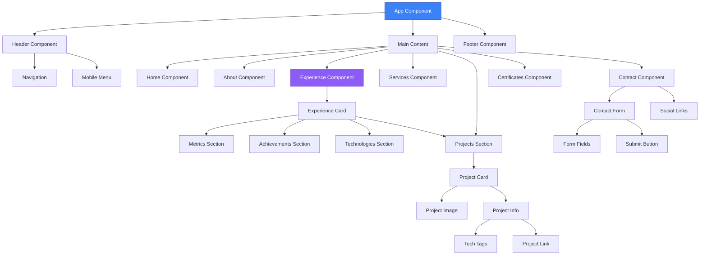

## 🎭 User Interaction Flow

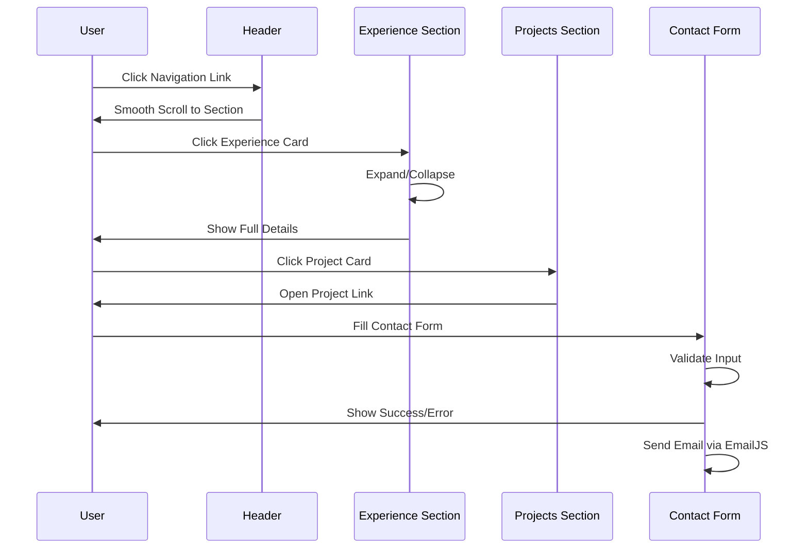

## 🎨 Visual Design Elements

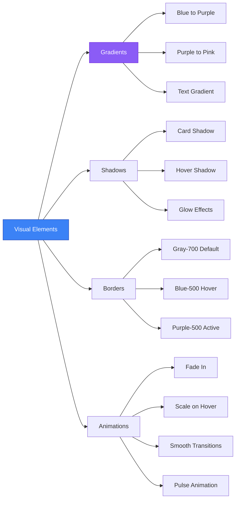

## 📐 Layout Grid System

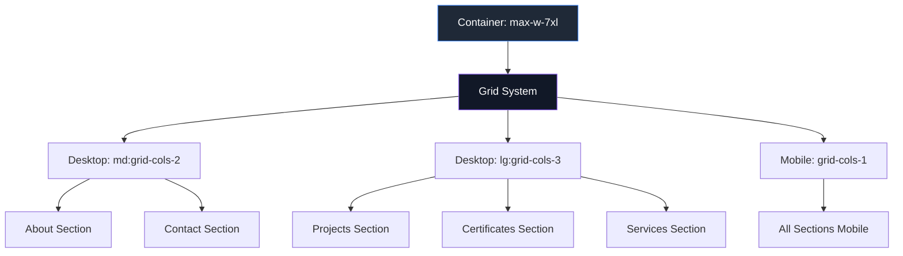

## 🎯 Experience Card Detailed Structure

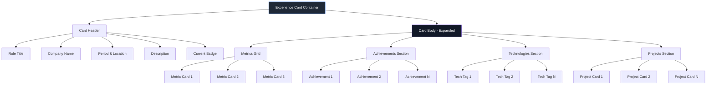

## 🚀 Performance & Optimization Flow

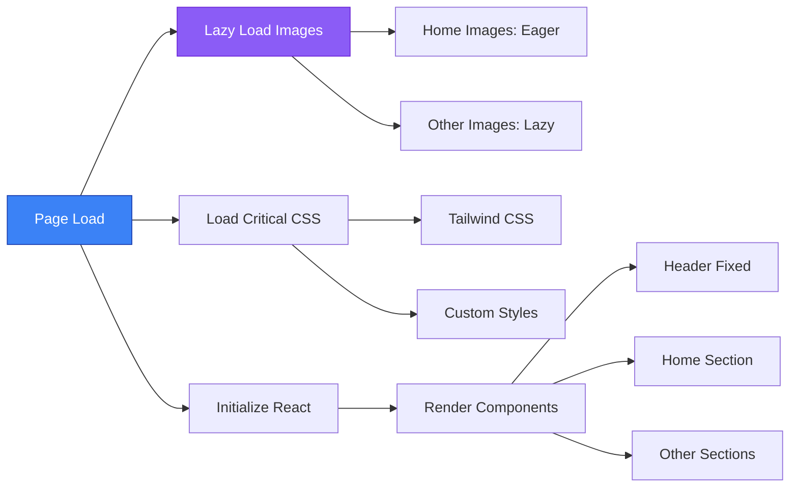

---

## 📝 Usage Instructions

1. **Copy the Mermaid code** from any diagram above
2. **Paste into**:
   - GitHub README.md (renders automatically)
   - Mermaid Live Editor: https://mermaid.live
   - VS Code with Mermaid extension
   - Notion, Obsidian, or other Markdown editors

3. **Customize**:
   - Change colors by modifying `fill` and `stroke` values
   - Adjust node shapes by changing `[Node]` to `([Node])` or `{Node}`
   - Add more connections and relationships

## 🎨 Design Principles Applied

- **Consistency**: Unified color scheme and spacing
- **Hierarchy**: Clear visual hierarchy with typography and spacing
- **Interactivity**: Smooth transitions and hover states
- **Accessibility**: ARIA labels and keyboard navigation
- **Responsiveness**: Mobile-first approach with breakpoints
- **Performance**: Lazy loading and optimized assets

